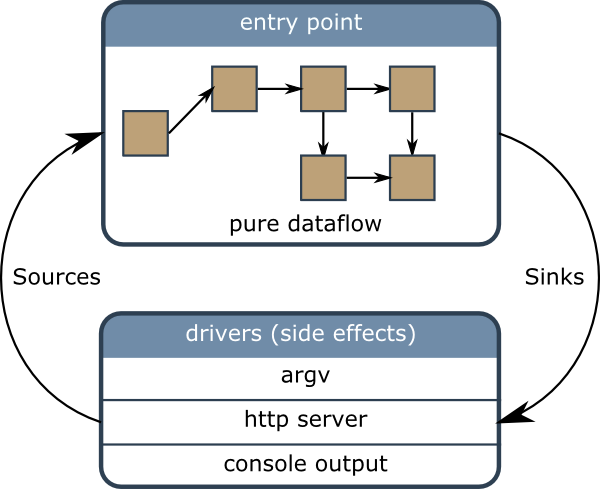

Rationale
==========

A Cyclotron application is composed of two parts:

* Components, that are composed of pure code.
* Drivers, that implement side effects.

Components and drivers comunicate via Observables. Communication between 
components and drivers is done via sink Observables. Communication between
drivers and components is done via source Observables.

