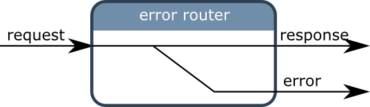

Routers
========

Routers as used to keep the codeflow linear when several drivers are used in a 
chain of opertors. 

crossroad
---------

.. autofunction:: cyclotron.router.make_crossroad_router

error router
------------

An error router takes a higher order observable a input and returns two 
observables: One containing the flattened items of the input observable
and another one containing the flattened errors of the input observable.

Error router as created by using two functions:

* make_error_router to create the routing.
* catch_or_flat_map to use this router easily.

.. autofunction:: cyclotron.router.make_error_router

.. autofunction:: cyclotron.router.catch_or_flat_map

